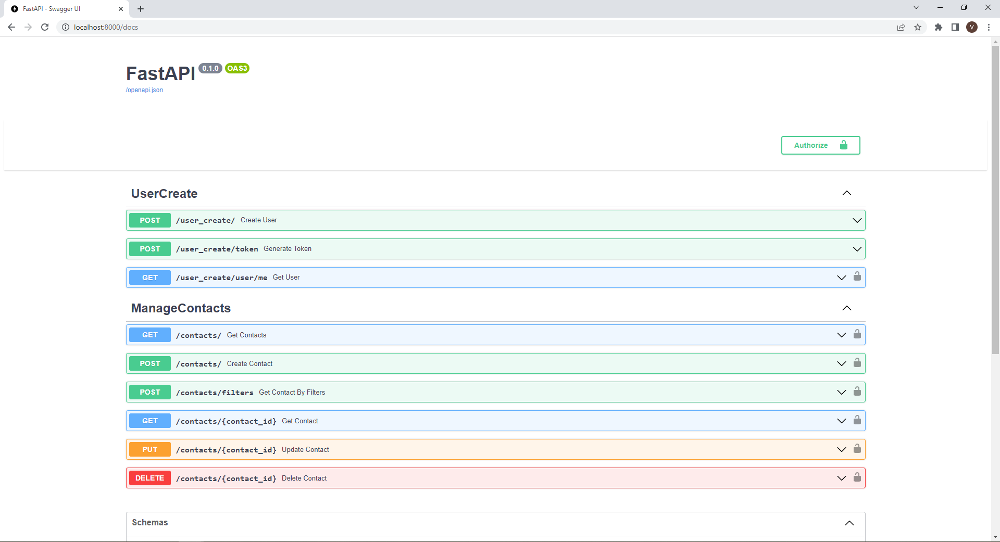

# Contact Book

This application let you to create and manage your own Contact Book using credentials for different user.

## Built with

The application was built with [Python 3.11](https://www.python.org/) using [FastAPI](https://fastapi.tiangolo.com/) framework 

## Getting Started

To run the application on your local, please follow the below instructions:

1. Clone the repo on your local
2. Open the ```root``` folder on terminal
3. Create a virtual environment using ```python -m venv .venv```
4. Activate the virtual environment ```.\venv/Scripts/activate```
5. Install requirements ```pip install -r requirements.txt```
6. Open a Python terminal and create the database with the below command:
   ```python
   from ContactBook.services import utils
    
   utils.create_database()
   ```
   python -c "from ContactBook.services import utils; utils.create_database()"
   
   validar la version de python instaladas en el computador con el comando: py --list
   validar la version de python que se esta usandon en el entorno: python --version
   y usando este comando se utilizara la version 3.11 para el entorno virtual: py -3.11 -m venv venv

7. On terminal, write ```uvicorn ContactBook.main:app --port 8000 --reload```
8. On a browser ```http://localhost:8000/docs``` to interact with Swagger Documentation

## Usage



## Contact

Victor Agudelo - vmanuel.agudelo@udea.edu.co

Project Link: https://github.com/aldebaran561/ContactsBook

